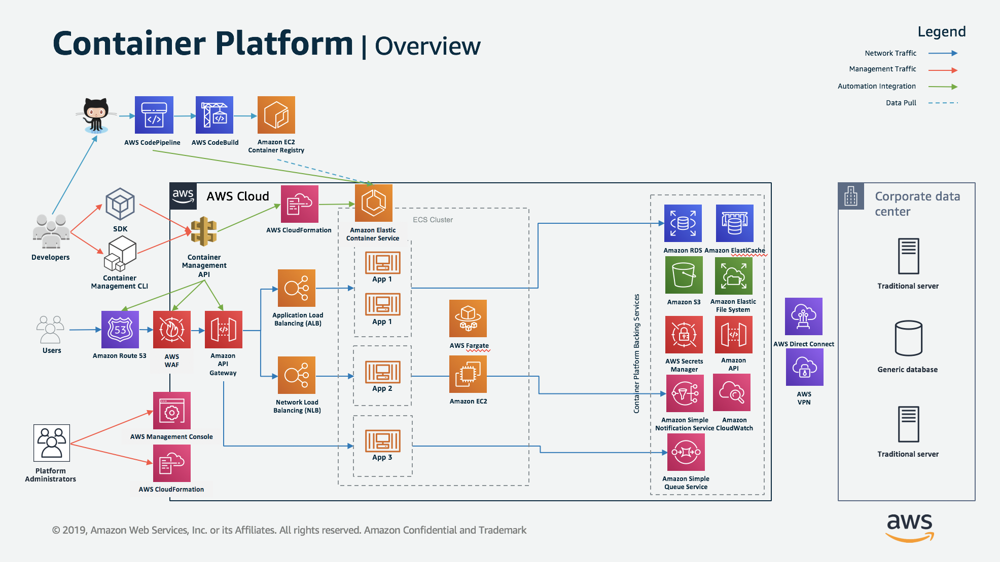
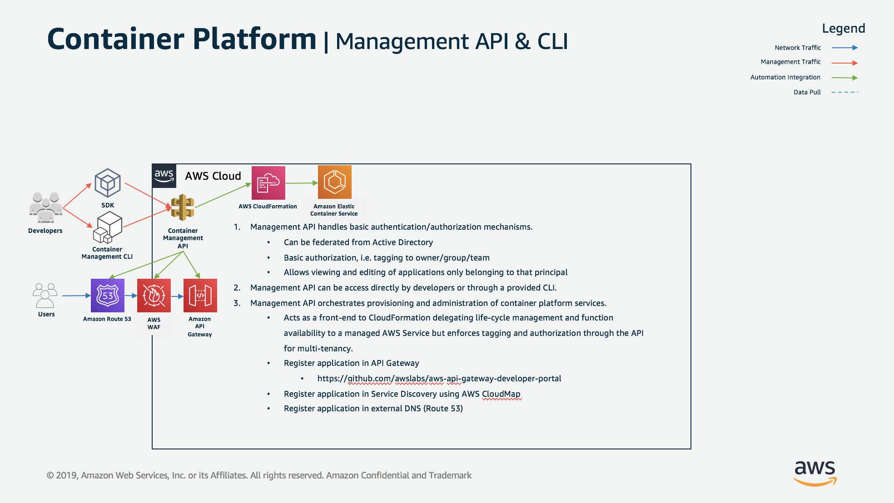

# Gureume Management API

This reference architecture provides a set of YAML templates for deploying the Gureume Management API with [AWS CloudFormation](https://aws.amazon.com/cloudformation/).

## Overview

The architecture consists of two parts, the supporting platform and the management API.
This repository and templates deploy the management API. To modify or deploy the platform, please see the gureume-platform repository.

### Architecture Overview



### API Overview



## Template details

The templates below are included in this repository and reference architecture:

| Template | Description |
| --- | --- |
| [lambda_layers/dependencies/](lambda_layers/dependencies/) | Shared Python libraries deployed as a Lambda Layer. |
| [src/](src/) | Source code for Lambda functions corresponding to API actions. |
| [template.yaml](template.yaml) | This is the master template - deploy it to CloudFormation and it includes all of the others automatically. |

## Deployment Instructions

### Prerequisites

#### AWS X-Ray SDK

This repository does not include a shared lambda layer with the [AWS X-Ray SDK](https://github.com/aws/aws-xray-sdk-python). You can either disable the use of AWS X-Ray in the source code or follow below instructions to create a [Lambda Deployment Package](https://docs.aws.amazon.com/lambda/latest/dg/lambda-python-how-to-create-deployment-package.html) that is referenced in the template.yaml and automatically attached as a [AWS Lambda Layer](https://docs.aws.amazon.com/lambda/latest/dg/configuration-layers.html) to the required lambda functions.

```bash
[project_root] pip install aws-xray-sdk --target lambda_layers/aws-xray-sdk/python
```

### Manual Deployment

You can use the included bash script to quickly deploy the API in your account. Modify the properties in the deploy.sh and then run the following commands.

```bash
./deploy.sh
```

## User Account Setup

Once you have the API up and running you will need to configure your developer accounts so that they can interact with the platform. Follow the below steps to create groups and user accounts for your development teams.

### 1. Create Team Roles

1.1 Navigate to [IAM Roles](https://console.aws.amazon.com/iam/home#/roles) and create a role for each of your development teams using the below policy.

```json
{
    "Version": "2012-10-17",
    "Statement": [
        {
            "Action": [
                "logs:Describe*",
                "logs:Get*",
                "logs:List*",
                "logs:TestMetricFilter"
            ],
            "Effect": "Allow",
            "Resource": "*"
        },
        {
            "Action": [
                "logs:FilterLogEvents"
            ],
            "Effect": "Allow",
            "Resource": "arn:aws:logs:[Enter region id]:[Enter account id]:log-group:[Enter team name]*"
        },
        {
            "Action": [
                "logs:FilterLogEvents"
            ],
            "Effect": "Allow",
            "Resource": "arn:aws:logs:[Enter region id]:[Enter account id]:log-group:/aws/codebuild/*"
        }
    ]
}
```

### 2. Configure Cognito

#### 2.1 Create Groups
2.1.1 Navigate to [Cognito User Pools](https://console.aws.amazon.com/cognito/users/) on the web console and select `gureume_users`.

2.1.2 Select `Users and groups` from the navigation panel under general settings.

2.1.3 From the group tab create a new group for each team and assign the correct IAM role created in the last step. *Note: the group name should match the 'team name' defined in the policy.*

#### 2.2 Create Users

2.2.1 From the `Users and groups` page, select `Create user` and enter the user's details.

2.2.2 Go back to the groups that you created in the last section and added the newly created users to the correct groups.
